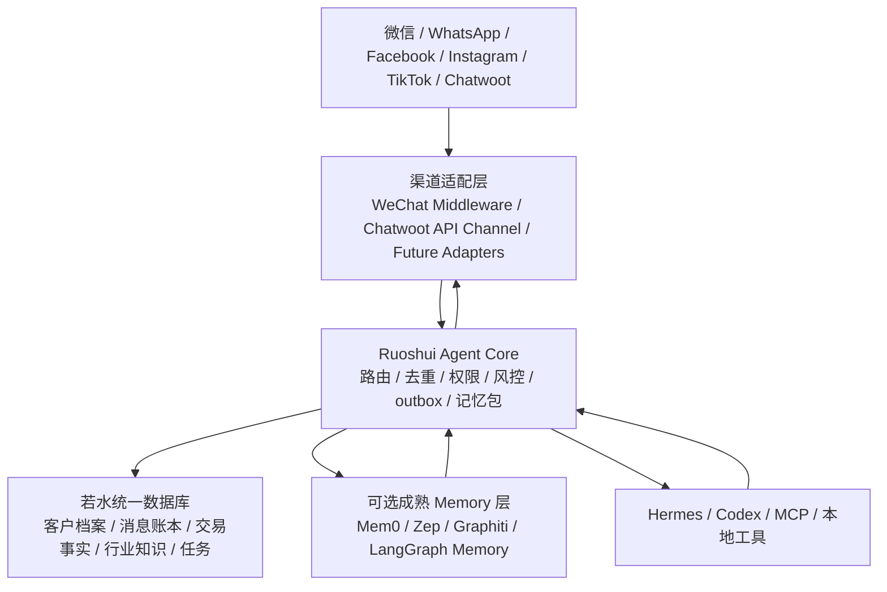

# 若水系统数据库优先与记忆管理总方案 2026-07-06

> 当前决策：先建设若水自有统一数据库，形成可信事实底座；成熟 Agent Memory 框架可以后续接入，但只能作为记忆抽取、召回、去重、总结的增强层，不能替代若水核心数据库。

---

## 1. 核心结论

若水系统不能把长期记忆完全放在 Hermes session、Chatwoot、某个第三方 Agent 或单一向量库里。

原因：

- Hermes session 适合连续对话，但不是公司级事实库。
- Chatwoot 适合做前台 inbox 和 CRM 展示，不适合承载行业知识、交易记录和复杂人脉档案。
- 第三方记忆框架成熟，但会带来数据边界、可控性、迁移和审计问题。
- 若水业务涉及报价、合同、客户关系、供应链、人脉、行业行情，这些必须可查、可审、可迁移、可备份。

所以最终结构是：

```text
自有统一数据库 = 唯一可信底座
成熟记忆框架 = 可替换的智能增强层
Hermes/Codex/MCP = 工具和推理层
Chatwoot = 前台展示和团队协作层
WeChat Middleware = 微信适配和真实收发层
```

---

## 2. 整体架构



边界原则：

- 微信真实发送只走中间层，不让 Hermes 或 Chatwoot 直接调 DLL。
- Hermes 不直接写数据库，只返回结构化 `memory_updates`、`tasks`、`business_facts`。
- Core 负责校验、去重、归档、证据关联和写库。
- 成熟 Memory 框架后续接入时，只读标准消息和档案，只把建议写回 Core API。

---

## 3. 两级数据库设计

### 3.1 一级库：行业专业知识库

用途：回答“现在市场什么价、什么指标、什么政策、什么供需状态”。

建议模块：

- 硫磺
- 磷矿
- 铜矿
- a 石膏粉
- 能源 / 煤炭
- 白糖 / 萤石 / 其他

核心表：

```text
industry_facts
- module
- fact_type
- subject
- content
- value
- unit
- region
- source
- source_url
- confidence
- observed_at
- expires_at
- raw_json
```

原则：

- 行业库不存具体客户隐私。
- 每个事实必须有来源、时间和可信度。
- 行情类数据必须有过期时间。
- AI 只能引用，不允许无证据改写历史事实。

### 3.2 二级库：客户个人档案库

用途：回答“这个人是谁、什么关系、什么风格、之前聊过什么、承诺过什么”。

核心表：

```text
contacts
contact_identities
conversations
messages
memory_items
customer_profiles
contact_preferences
relationship_styles
business_facts
tasks
outbox
```

原则：

- 一个人一个主档案，多个平台身份归并到同一个 `contact_id`。
- 人和人不交叉污染；人脉关系用关系表表达，不混入个人事实。
- 所有长期记忆必须能追溯到消息、文件或人工确认。
- 低可信内容先进草稿或待确认，不直接成为长期事实。

---

## 4. 成熟 Memory 框架的定位

短期不让第三方 Memory 框架做主库。

后续可以评估：

| 方案 | 适合做什么 | 是否做主库 |
| --- | --- | --- |
| Mem0 | 对话偏好、长期记忆抽取、召回 | 否 |
| Zep / Graphiti | 时间知识图谱、人脉关系、事实变化 | 否 |
| Letta / MemGPT | 有状态 Agent 运行时 | 否，暂不优先 |
| LangGraph Memory | 复杂 Agent 编排内的长期记忆 | 否 |

推荐路线：

```text
Phase A：先建自有 DB 和写入 API
Phase B：用 Hermes/Codex 先提交结构化 memory_updates
Phase C：接 Mem0 做记忆抽取和召回实验
Phase D：接 Zep/Graphiti 做人脉和时间关系图谱实验
Phase E：成熟后再决定是否替换部分自研逻辑
```

---

## 5. 当前已落地内容

代码文件：

```text
D:\api\Ruoshui_Unified_Agent_Core\services\ruoshui_agent_service.py
```

数据库：

```text
D:\api\Ruoshui_Unified_Agent_Core\data\unified_memory.db
```

已新增/补强的表：

```text
memory_items
memory_item_evidence
customer_profiles
contact_preferences
relationship_styles
business_facts
tasks
industry_facts
```

已新增 API：

```text
GET  /memory/context
POST /memory/update
POST /tasks/upsert
POST /business-facts/upsert
```

Hermes 返回格式已扩展：

```json
{
  "decision": "reply",
  "customer_reply": "客户可见回复",
  "confidence": 0.9,
  "needs_human": false,
  "memory_updates": [],
  "tasks": [],
  "business_facts": []
}
```

写入规则：

- `memory_updates` 写入 `memory_items`，并按类型投影到 `contact_preferences`、`relationship_styles`、`customer_profiles`。
- `tasks` 写入 `tasks`。
- `business_facts` 写入 `business_facts`。
- 所有写入带 `confidence`、`status`、`evidence_json`。

---

## 6. 今日验证结果

验证时间：2026-07-06 12:08 左右。

因为生产端口 `8765` 被一个早期管理员 Agent Core 进程占用，普通权限无法停止，最新版 Core 先在 `8766` 做了无客户打扰验证。

验证结果：

```text
GET  http://127.0.0.1:8766/health
memory_items: 1
tasks: 1
business_facts: 0
```

已写入第一条长期记忆：

```text
宋生确认若水系统先建设自有统一数据库作为可信底座，Hermes 和后续成熟记忆框架只提交结构化更新，不直接接管核心数据库。
```

已写入第一条任务：

```text
建立若水统一数据库一期结构和写入接口
```

读取验证：

```text
GET http://127.0.0.1:8766/memory/context?contact_id=1
```

返回包含上述 `memory_items` 和 `tasks`。

---

## 7. 当前运行风险

### 7.1 8765 有旧管理员进程

当前发现：

```text
127.0.0.1:8765 -> 旧 Agent Core 管理员进程
127.0.0.1:8766 -> 最新 Agent Core 验证进程
```

影响：

- 中间层当前仍指向 `agent_core_url=http://127.0.0.1:8765`。
- 新增 `/memory/update`、`/memory/context` 等接口在 8766 验证通过，但 8765 旧进程未加载。
- 这类旧进程残留正是“电脑重启后迟钝、错误、接口不一致”的主要风险之一。

下一步必须做：

```text
以管理员权限停止旧 8765 Agent Core
用最新版 services/ruoshui_agent_service.py 重启 8765
确认 8765 /memory/context 和 /memory/update 可用
```

### 7.2 健康检查应增加版本字段

已完成。新版 Core `/health` 已返回：

```text
service_version
enabled_routes
code_path
root
```

当前验证版本：

```text
service_version = 2026-07-06.database-first-memory-v1
code_path = D:\api\Ruoshui_Unified_Agent_Core\services\ruoshui_agent_service.py
```

这样以后不会再出现“端口通了但跑的是旧代码”的假正常。

### 7.3 8765 管理员切换脚本

已新增脚本：

```text
D:\api\Ruoshui_Unified_Agent_Core\tools\switch_agent_core_8765_admin.ps1
```

用途：

- 检查当前 `8765` 监听进程。
- 停止旧 Agent Core。
- 用最新版 `services\ruoshui_agent_service.py` 启动 `8765`。
- 校验 `/health.service_version`。
- 校验 `/memory/context`、`/memory/update` 是否在 `enabled_routes` 中。

执行方式：

```powershell
Start-Process powershell -Verb RunAs -ArgumentList '-ExecutionPolicy Bypass -File D:\api\Ruoshui_Unified_Agent_Core\tools\switch_agent_core_8765_admin.ps1'
```

当前状态：

```text
8765 -> PID 14424，旧管理员 Core
8766 -> 新版 Core，service_version=2026-07-06.database-first-memory-v1
```

### 7.4 临时生产入口调整为 8766

因为 `8765` 旧管理员进程暂时无法在当前权限下停止，已把微信中间层的启动脚本改为指向新版 Core `8766`：

```text
D:\api\WeChatWin_4.1.8.27_hook\tools\restart_middleware_admin_only.ps1
D:\api\WeChatWin_4.1.8.27_hook\tools\start_wechat_stack.ps1
```

变更：

```text
AGENT_CORE_URL=http://127.0.0.1:8766
```

当前注意：

```text
中间层已重启，当前 agent_core_url=http://127.0.0.1:8766。
5001 /api/health 显示 dll_connected=true，backlog_count=0。
```

临时方案目的：

- 不强杀旧管理员 `8765`。
- 让后续中间层重启后直接使用新版数据库优先 Core。
- 保留后续清理 `8765` 的管理员脚本。

当前生产状态：

```text
5000/5001 -> 主微信中间层 PID 34916
agent_core_url -> http://127.0.0.1:8766
8766 -> 新版 Core，service_version=2026-07-06.database-first-memory-v1
8765 -> 旧管理员 Core，暂时保留，后续清理
```

---

## 8. 下一步计划

### P0：统一数据库正式启用

1. 当前临时生产入口使用 8766，新版 Core 已接管主微信中间层调用。
2. 后续清理 8765 旧进程，决定是否把生产入口统一回 8765。
3. 验证：
   - `/health`
   - `/memory/context`
   - `/memory/update`
   - `/agent/respond`
   - `/outbox/send`
4. 新增 `service_version` 和 `enabled_routes`。
5. 新增定时备份 `data/unified_memory.db`。

### P0：历史消息转长期记忆

1. 从 `messages` 中按联系人聚合。
2. 优先处理：
   - 宋生
   - S/A 级客户
   - 私聊
   - 报价、合同、付款、物流、产品指标、人脉关系
3. 先生成候选记忆，不直接全部生效。
4. 人工或 Codex 审核高价值记忆。
5. 写入 `memory_items`、`business_facts`、`tasks`。

### P1：接成熟 Memory 框架实验

1. 先选 Mem0 做本地实验。
2. 输入标准化消息和客户档案。
3. 输出结构化 `memory_updates`。
4. 只通过 `/memory/update` 写入 Core。
5. 对比 Hermes 手动抽取和 Mem0 自动抽取质量。

### P1：行业库

1. 先建硫磺、磷矿两个模块。
2. 每条行情数据必须带来源、时间、有效期。
3. 每日定时入库。
4. 回复前按产品和客户上下文召回。

### P2：人脉关系图谱

1. 新增 `relationship_edges`。
2. 标记：
   - 谁认识谁
   - 谁介绍谁
   - 谁信任谁
   - 谁是买方/卖方/中间人
3. 后续评估 Zep/Graphiti。

---

## 9. 总原则

```text
先数据库，后智能层。
先可信事实，后自动总结。
先可审计，后全自动。
先若水自有底座，后接 Mem0/Zep 等成熟框架。
```

这条路线既能尽快投入使用，也能保证长期不被某个工具、某个 session、某个第三方平台锁死。
